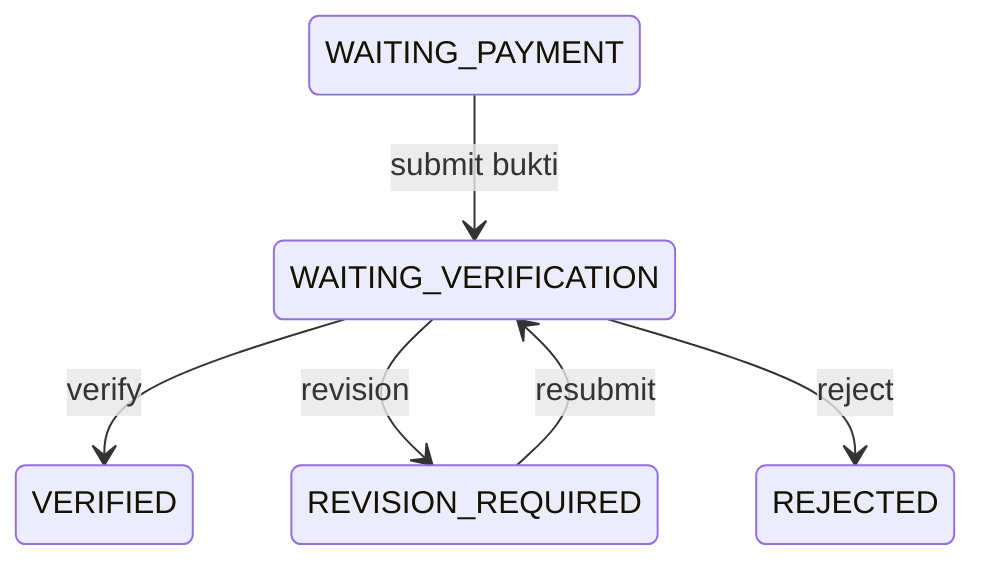

# ISAC 2026 API dan Bruno Testing

Dokumen ini adalah kontrak canonical untuk seluruh JSON API ISAC 2026. Koleksi
di folder `collections/` memakai format OpenCollection dengan preset Bruno dan
mencakup semua route pada `routes/api.php`.

## Menjalankan secara lokal

Seluruh command project dijalankan melalui Docker:

```bash
docker compose up -d
docker exec isac2026-app php artisan migrate --seed --force
```

Gunakan environment `environments/local.yaml`. Base URL Docker lokal adalah
`http://localhost:8080`. Jangan commit Bearer token asli; field `apiToken` dan
`adminToken` memang dikosongkan.

Alur penggunaan Bruno:

1. Buka folder `docs/API` sebagai collection/workspace OpenCollection di Bruno.
2. Pilih environment `Local`.
3. Jalankan `Auth/login` dengan `teamEmail` dan `teamPassword`.
4. Salin `data.token` ke `apiToken` untuk request Team.
5. Ubah login ke `adminEmail` dan `adminPassword`, lalu salin token ke `adminToken`.
6. Isi UUID hasil response ke `competition_id`, `batch_id`, `team_id`,
   `registration_id`, `stage_id`, atau `file_id` sesuai request berikutnya.

Account seed menggunakan password `password123`. Contoh yang tersedia:

- Team progres awal: `profile@team.isac.test`
- Team belum verifikasi: `unverified@team.isac.test`, OTP lokal `000000`
- Super admin: `superadmin@isac.test`
- Admin registrasi: `registration@isac.test`
- Admin pembayaran: `payment@isac.test`

## Kontrak umum

- Request JSON menggunakan `snake_case`.
- Response data menggunakan `camelCase`.
- Bearer token dikirim sebagai `Authorization: Bearer <token>`.
- Endpoint Team membutuhkan `auth:sanctum`, principal Team, dan email yang sudah
  diverifikasi, kecuali endpoint auth verifikasi email.
- Endpoint Admin membutuhkan token Admin dan policy role yang sesuai.
- Mutation auth/registration yang membutuhkan navigasi mengirim `redirectTo`.

Envelope sukses:

```json
{
  "status": "success",
  "message": "Operasi berhasil.",
  "data": {},
  "metadata": {},
  "error": null
}
```

Envelope gagal:

```json
{
  "status": "error",
  "message": "The given data was invalid.",
  "data": null,
  "metadata": {},
  "error": {
    "code": "VALIDATION_ERROR",
    "details": {
      "field": ["Pesan validasi."]
    }
  }
}
```

Status penting: `401` unauthenticated, `403` policy/principal salah, `404`
resource tidak ditemukan, `409` account ambigu, `422` validasi/domain, `429`
rate limit, dan `503 EMAIL_DELIVERY_FAILED` ketika provider email gagal.

## Daftar endpoint lengkap (52)

### System, dashboard, Team, file, dan ImageKit

| Method | Endpoint | Auth | Fungsi |
|---|---|---|---|
| GET | `/api/system/status` | Public | Health dan metadata runtime |
| GET | `/api/dashboard/summary` | Team | Summary dashboard dan status registrasi |
| GET | `/api/teams/me` | Team | Profil Team aktif |
| PATCH | `/api/teams/me` | Team | Update parsial profil Team |
| POST | `/api/files` | Team/Admin | Daftarkan metadata file ImageKit |
| GET | `/api/files/{file}` | Team/Admin | Ambil metadata file sesuai ownership |
| GET | `/api/imagekit-auth` | Team/Admin | Signature upload langsung ke ImageKit |

### Authentication

| Method | Endpoint | Auth | Fungsi |
|---|---|---|---|
| POST | `/api/auth/register` | Public | Buat akun Team, kirim OTP, terbitkan token |
| POST | `/api/auth/login` | Public | Shared login Team/Admin |
| POST | `/api/auth/forgot-password` | Public | Kirim OTP reset password |
| POST | `/api/auth/reset-password/verify` | Public | Verifikasi OTP dan terbitkan reset token |
| POST | `/api/auth/reset-password` | Public | Ganti password dengan reset token |
| POST | `/api/auth/logout` | Team/Admin | Revoke current token |
| GET | `/api/auth/me` | Team/Admin | Pulihkan principal session |
| POST | `/api/auth/verify-email/resend` | Team | Kirim ulang OTP verifikasi |
| POST | `/api/auth/verify-email` | Team | Verifikasi email dengan OTP |

### Competition dan Batch publik

| Method | Endpoint | Auth | Fungsi |
|---|---|---|---|
| GET | `/api/competitions` | Public | List/filter Competition paginated |
| GET | `/api/competitions/open` | Public | Competition yang membuka registrasi |
| GET | `/api/competitions/{competition}` | Public | Detail Competition beserta Batch |
| GET | `/api/competitions/{competition}/batches/open` | Public | Batch aktif untuk Competition |

### Registration Team

| Method | Endpoint | Auth | Fungsi |
|---|---|---|---|
| GET | `/api/registrations/me/context` | Team | Source of truth current step |
| POST | `/api/registrations/me/selection` | Team | Pilih Competition dan Batch |
| GET | `/api/registrations/me/team` | Team | Data form Team |
| PATCH | `/api/registrations/me/team` | Team | Simpan profil dan alamat institusi |
| GET | `/api/registrations/me/members` | Team | Data/constraint biodata peserta |
| PUT | `/api/registrations/me/members` | Team | Finalisasi seluruh peserta |
| GET | `/api/registrations/me/documents` | Team | Data dokumen |
| PATCH | `/api/registrations/me/documents` | Team | Simpan Google Drive URL |
| GET | `/api/registrations/me/payment` | Team | Form dan snapshot pembayaran |
| POST | `/api/registrations/me/payment/quote` | Team | Hitung promo tanpa menyimpan |
| POST | `/api/registrations/me/payment` | Team | Ajukan bukti pembayaran |
| GET | `/api/registrations/me/summary` | Team | Summary lengkap registrasi |
| POST | `/api/registrations/me/submit-verification` | Team | Finalisasi untuk verifikasi Admin |

### Admin

| Method | Endpoint | Auth | Fungsi |
|---|---|---|---|
| GET | `/api/admin/teams` | Admin | List/filter Team paginated |
| GET | `/api/admin/teams/{team}` | Admin | Detail Team |
| POST | `/api/admin/teams/{team}/verify` | Admin | Verifikasi data Team |
| POST | `/api/admin/teams/{team}/revision` | Admin | Minta revisi TEAM/MEMBERS/DOCUMENTS |
| POST | `/api/admin/teams/{team}/reject` | Admin | Tolak data Team |
| GET | `/api/admin/payments` | Admin | Antrean pembayaran paginated dengan filter |
| GET | `/api/admin/payments/{registration}` | Admin | Detail pembayaran untuk review |
| POST | `/api/admin/registrations/{registration}/payment/verify` | Admin | Verifikasi pembayaran |
| POST | `/api/admin/registrations/{registration}/payment/revision` | Admin | Minta revisi pembayaran |
| POST | `/api/admin/registrations/{registration}/payment/reject` | Admin | Tolak pembayaran |
| POST | `/api/admin/teams/{team}/stages/{stage}/advance` | Admin | Proses Stage berikutnya |
| GET | `/api/admin/stages/{stage}/scores` | Admin | Nilai per Team pada satu Stage (adaptif exam/submission) |
| POST | `/api/admin/competitions` | Admin | Buat Competition |
| PATCH | `/api/admin/competitions/{competition}` | Admin | Update Competition |
| DELETE | `/api/admin/competitions/{competition}` | Admin | Hapus Competition yang aman dihapus |
| GET | `/api/admin/batches` | Admin | List/filter Batch |
| POST | `/api/admin/batches` | Admin | Buat Batch |
| GET | `/api/admin/batches/{batch}` | Admin | Detail Batch |
| PATCH | `/api/admin/batches/{batch}` | Admin | Update Batch |
| DELETE | `/api/admin/batches/{batch}` | Admin | Hapus Batch yang aman dihapus |

## Payload canonical utama

### Profil Team dan alamat

Form UI menampilkan enam string secara responsif: tiga identitas di kolom kiri
dan tiga alamat di kolom kanan. API menyimpan alamat sebagai satu JSON string.

```json
{
  "name": "Alpha Team",
  "phone": "081234567890",
  "institution_name": "SMA Negeri 1 Surabaya",
  "institution_address": "{\"province\":\"Jawa Timur\",\"city\":\"Surabaya\",\"address\":\"Jl. Wijaya Kusuma No. 48\"}"
}
```

`institution_address` wajib dapat di-decode menjadi object dengan tiga key
string non-kosong: `province`, `city`, dan `address`.

### Biodata peserta

- Olimpiade: tepat 1 peserta; backend menormalisasi role menjadi `LEADER`.
- Business Plan: tepat 3 siswa; satu `LEADER`, dua `MEMBER`.
- Business IT Case: tepat 3 mahasiswa; satu `LEADER`, dua `MEMBER`.
- Siswa memakai NISN. Mahasiswa memakai NIM serta wajib `major` dan `faculty`.
- `student_id` selalu string 3–50 karakter. Foto opsional.

```json
{
  "members": [
    {
      "name": "Ketua",
      "role": "LEADER",
      "email": "ketua@example.com",
      "major": "Informatika",
      "faculty": "Teknik",
      "student_id": "240001",
      "photo_file_id": null,
      "sort_order": 1
    }
  ]
}
```

### File dan pembayaran

File di-upload langsung ke ImageKit setelah mengambil signature. Metadata hasil
upload kemudian didaftarkan:

```json
{
  "file_id": "imagekit-provider-id",
  "url": "https://ik.imagekit.io/account/payment.png",
  "purpose": "PAYMENT_PROOF"
}
```

Purpose Team: `PAYMENT_PROOF`, `MEMBER_PHOTO`, `SUBMISSION`. Purpose Admin
registrasi/super admin: `BATCH_MODULE`. Ownership dan purpose divalidasi kembali
saat file dipakai oleh registration.

Pembayaran:

```json
{
  "payment_proof_file_id": "uuid-file-metadata",
  "payment_method": "QRIS",
  "promo_code": "ISAXOP"
}
```

Promo di-quote lewat `/payment/quote`; total final dihitung ulang oleh backend
dan disimpan sebagai snapshot. Client tidak mengirim nominal atau ID transaksi.

### Admin pembayaran

**Payment gate eligibility:**
- Competition tipe `UPFRONT`: seluruh Registration masuk antrean.
- Competition tipe `SEMIFINAL`: hanya Registration dengan `payment_required_at`
  terisi yang masuk antrean. Business yang belum mencapai gate semifinal tidak
  dianggap "belum bayar".

**Role matrix:**

| Aksi | super_admin | admin_payment | admin_registration | judge |
|---|---|---|---|---|
| Lihat antrean & detail | ✅ | ✅ | ✅ | ✅ |
| Verify payment | ✅ | ✅ | ❌ | ❌ |
| Revision payment | ✅ | ✅ | ❌ | ❌ |
| Reject payment | ✅ | ✅ | ❌ | ❌ |

**Filter antrean (`GET /api/admin/payments`):**
- `search` — cari kode/nama/email/institusi Team.
- `status` — RegistrationStatus (WAITING_PAYMENT, WAITING_VERIFICATION, VERIFIED,
  REJECTED, REVISION_REQUIRED, CANCELLED).
- `competition_id`, `batch_id` — UUID.
- `payment_method` — BANK_TRANSFER atau QRIS.
- `page`, `per_page` — pagination (maks 100).

Urutan prioritas: WAITING_VERIFICATION > REVISION_REQUIRED > WAITING_PAYMENT >
REJECTED > VERIFIED > CANCELLED, lalu createdAt descending.

**State transition pembayaran:**



**Response detail (`GET /api/admin/payments/{registration}`) — AdminPaymentResource:**
- `registrationId`, `status`, `paymentContext` (REGISTRATION/SEMIFINAL).
- `isSubmitted`, `canBeReviewed` — status kelengkapan dan eligibility review.
- `team` — id, code, name, email, phone, institutionName.
- `competition` — id, name, type, category.
- `batch` — id, name, price, startDate, endDate.
- `targetStage` — stage yang akan diaktifkan setelah verify.
- `payment` — originalAmount, amount, method, promoCode, discountPercent,
  discountAmount, proof (FileResource), submittedAt, paidAt, reviewedAt,
  reviewedBy, rejectionReason.
- `timeline` — array riwayat status beserta timestamp.

**Mutation payment:**
- Verify/Revision/Reject hanya berlaku pada status `WAITING_VERIFICATION` dengan
  bukti pembayaran.
- Reason untuk revision/reject: wajib 1–2000 karakter.
- Semua mutation menggunakan transaction + row locking untuk cegah konflik.
- Response memakai `AdminPaymentResource` yang sama.
- Audit log dengan `X-Request-ID` dicatat untuk setiap transisi.

## Workflow pengujian end-to-end

Team baru:

1. Register, simpan token, verifikasi OTP.
2. Ambil Competition open dan Batch open, isi UUID environment.
3. Selection → Team profile → members → documents.
4. Olimpiade: quote payment → ImageKit auth/upload → register file → submit payment.
5. Ambil summary dan dashboard. `redirectTo` harus mengikuti current step aktual.

Admin:

1. Login Admin dan isi `adminToken`.
2. Ambil `/api/admin/teams`, simpan `team_id` dan `registration_id`.
3. Verifikasi/revisi/tolak data sesuai role.
4. Untuk Olimpiade, verifikasi data dan pembayaran adalah operasi terpisah.
5. Advance Stage hanya boleh mengikuti urutan Stage dan payment gate domain.

Mutation Admin menerima header opsional `X-Request-ID`. Setiap transisi penting
dicatat di `admin_audit_logs` dengan actor, before/after state, reason, dan
request ID.
