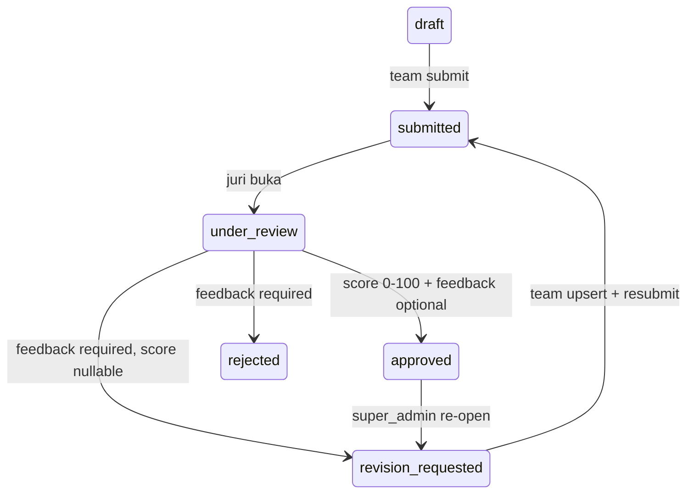

# Penilaian Submission — Simple Score 0-100 + Feedback (B1)

> **For agentic workers:** REQUIRED SUB-SKILL: Use superpowers:subagent-driven-development (recommended) or superpowers:executing-plans to implement this plan task-by-task. Steps use checkbox (`- [ ]`) syntax for tracking.

**Goal:** Juri/Admin dapat menilai submission per-team per-stage dengan **1 skor 0-100 + 1 feedback + 1 status** (`approved/rejected/revision_requested/under_review`), langsung jadi nilai akhir, alert `flagged` dari detection tidak auto, list terfilter, audit `admin_audit_logs`.

**Architecture:** `JudgingController (Admin) → JudgingService (lockForUpdate, status transition) → Submission + AdminAuditLog → SubmissionResource`. `Stage.criteria` tidak dipakai (Simple). Frontend `features/judging` (api/hooks) + `Pages/Admin/Judging.tsx` table + `JudgingDialog`. Reuse `Submission.score/feedback/reviewed_by/at` existing, no migration. Policy `judge, admin_registration, super_admin` via `Gate`.

**Tech Stack:** Laravel PHP 8.3, MySQL `submissions`, React 19 TS Inertia TanStack Query, Tailwind, Pest.

## Global Constraints

- No migration, reuse `submissions` columns existing.
- Request `snake_case`, response `camelCase`, envelope `{status,message,data,metadata,error}`.
- Auth `auth:admins` + `principal.admin`, authorize `Gate::authorize('judge', Submission::class)` atau role `judge/super_admin`.
- Score nullable (revision_requested bisa null), range 0-100 integer.
- Feedback 1-2000 chars untuk `revision_requested/rejected`, optional untuk `approved`.
- Audit `X-Request-ID` header.

---

## File Structure

- Create: `app/Http/Requests/Admin/ReviewSubmissionRequest.php`
- Create: `app/Services/JudgingService.php`
- Create: `app/Http/Controllers/Api/JudgingController.php`
- Create: `app/Http/Resources/JudgingSubmissionResource.php` (atau reuse `SubmissionResource` + team)
- Modify: `routes/api.php:57-99` — add `prefix('admin')->group` 3 routes
- Modify: `app/Policies/SubmissionPolicy.php` (create if not exists) atau `Gate` inline
- Create: `resources/js/features/judging/api/judgingApi.ts`
- Create: `resources/js/features/judging/hooks/useJudging.ts`
- Create: `resources/js/features/judging/types/judgingTypes.ts`
- Create: `resources/js/features/judging/components/JudgingDialog.tsx`
- Modify: `resources/js/Pages/Admin/Judging.tsx` — table, filters, badge
- Test: `tests/Feature/Judging/JudgingTest.php` (6 tests)
- Test: `tests/Feature/Admin/AdminStageScoresTest.php` — keep (adaptive scores)

---

## API Contract

### 1) GET /api/admin/stages/{stage}/submissions — List antrian penjurian
**Auth:** `judge, admin_registration, super_admin`
**Query:** `?status=draft,submitted,under_review,approved,rejected,revision_requested & search=teamCodeOrName & page & per_page max 100`
**Logic:** `Submission::where stage_id` with `with(team:id,code,name, file)`, order `submitted_at asc` untuk `submitted/under_review` first, then `revision_requested`, then others.
**Response 200:**
```json
{
  "status":"success",
  "data":{
    "data":[
      {"id":"uuid","team":{"id":"uuid","code":"ISAC001","name":"Alpha"},"title":"Karya","status":"submitted","score":null,"submittedAt":"...","file":{"url":"https://..."}},
    ],
    "meta":{"current_page":1,"total":12}
  }
}
```

### 2) GET /api/admin/submissions/{submission} — Detail
**Response:** `JudgingSubmissionResource` include `team, stage, file, feedback, score, reviewedBy, window`.

### 3) POST /api/admin/submissions/{submission}/review — Nilai (Simple)
**Auth:** `judge` only for `approved/rejected`, `judge/super_admin` for `revision_requested`?
**Request:**
```json
{"action":"approved|rejected|revision_requested","score":85,"feedback":"Bagus, lanjut final"}
```
Validation: `action required in approved,rejected,revision_requested,under_review`, `score nullable integer 0-100` (required if `approved`, nullable if `revision_requested`), `feedback required string 1-2000` if `rejected/revision_requested`, `max:2000` if `approved`.
**Transitions allowed:**
```
draft/submitted/under_review/revision_requested/rejected -> under_review
under_review/submitted -> approved (score required) / rejected / revision_requested
approved -> revision_requested (re-open) allowed by super_admin
```
Set `reviewed_by=admin.id, reviewed_at=now(), score, feedback, status=action`.
**Response 200:** `JudgingSubmissionResource`
**Audit:** `admin_audit_logs action=judging.review` with before/after.

**Errors:** 403 policy, 422 validation, 409 if `status` not allowed to transition.

### Flow Mermaid


---

### Task 1: ReviewSubmissionRequest + JudgingService

**Files:**
- Create: `app/Http/Requests/Admin/ReviewSubmissionRequest.php`
- Create: `app/Services/JudgingService.php`
- Test: `tests/Feature/Judging/JudgingTest.php` (part)

**Interfaces:**
- Consumes: `Submission`, `Admin`, `Gate`
- Produces: `ReviewSubmissionRequest rules()`, `JudgingService.review(Admin, Submission, array{action,score,feedback}): Submission`

- [ ] **Step 1: Write failing test**

```php
test('judge can approve submission with score', function(){
  $judge=Admin::factory()->create(['role'=>'judge']); $team=Team::factory()->create(); $stage=Stage::create([...]); $sub=Submission::create(['team_id'=>$team->id,'stage_id'=>$stage->id,'title'=>'T','status'=>'submitted']);
  $token=$judge->createToken('t')->plainTextToken;
  $this->withToken($token)->postJson("/api/admin/submissions/{$sub->id}/review", ['action'=>'approved','score'=>85,'feedback'=>'Bagus'])->assertOk()->assertJsonPath('data.status','approved')->assertJsonPath('data.score',85);
  expect($sub->fresh()->reviewed_by)->toBe($judge->id);
});
test('revision without feedback fails', function(){ ... post revision_requested without feedback => 422 });
test('score out of range fails', function(){ ... score 101 => 422 });
```

- [ ] **Step 2: Run → FAIL** — 404
- [ ] **Step 3: Implement**

```php
// ReviewSubmissionRequest
public function authorize(): bool { return Gate::allows('judge', Submission::class); }
public function rules(): array { return ['action'=>['required',Rule::in(['approved','rejected','revision_requested','under_review'])], 'score'=>['nullable','integer','min:0','max:100','required_if:action,approved'], 'feedback'=>['nullable','string','max:2000', Rule::requiredIf(fn()=>in_array($this->input('action'),['rejected','revision_requested']))]]; }
// JudgingService
public function review(Admin $admin, Submission $sub, array $data): Submission {
  return DB::transaction(function() use($admin,$sub,$data){
    $sub=Submission::lockForUpdate()->findOrFail($sub->id);
    $action=$data['action'];
    if(!in_array($sub->status,['submitted','under_review','draft','revision_requested','rejected'],true) && $action!=='under_review') throw ValidationException::withMessages(['status'=>['Tidak bisa dinilai']]);
    $before=$sub->toArray();
    $sub->update(['status'=>$action,'score'=>$data['score']??null,'feedback'=>$data['feedback']??null,'reviewed_by'=>$admin->id,'reviewed_at'=>now()]);
    app(SecurityAuditService::class)->log($admin,'judging.review',$sub,$before,$sub->fresh()->toArray(), $data['feedback']??null, request()->header('X-Request-ID'));
    return $sub->fresh()->load(['team','file','stage']);
  });
}
```

- [ ] **Step 4: Run → PASS**
- [ ] **Step 5: Commit**

---

### Task 2: JudgingController + Routes + Policy

**Files:**
- Create: `app/Http/Controllers/Api/JudgingController.php`
- Modify: `routes/api.php` — add group
- Create: `app/Policies/SubmissionPolicy.php` (or Gate)
- Test: same file

**Interfaces:**
- Produces: `JudgingController.index(Request, Stage), show(Submission), review(ReviewSubmissionRequest, Submission)`

- [ ] **Step 1: Write failing test** — `GET /admin/stages/{stage}/submissions` list + `GET detail` + `403 for team token`
- [ ] **Step 2: Run → FAIL**
- [ ] **Step 3: Implement**

```php
// JudgingController
public function index(Request $request, Stage $stage){ Gate::authorize('judge', Submission::class); $q=Submission::where('stage_id',$stage->id)->with(['team:id,code,name','file'])->when($request->status, fn($qq)=>$qq->where('status',$request->status))->orderByRaw("CASE WHEN status='submitted' THEN 0 WHEN status='under_review' THEN 1 ELSE 2 END")->paginate($request->per_page??20); return response()->json(['status'=>'success','data'=>JudgingSubmissionResource::collection($q)]); }
public function review(ReviewSubmissionRequest $request, Submission $submission){ $admin=$request->user(); return response()->json(['status'=>'success','data'=>new JudgingSubmissionResource($this->service->review($admin,$submission,$request->validated()))]); }
// Policy
public function judge(Admin $admin){ return in_array($admin->role,['judge','super_admin','admin_registration'],true); }
// routes
Route::prefix('admin')->middleware(['auth:admins','principal.admin'])->group(function(){ Route::get('/stages/{stage}/submissions',[JudgingController::class,'index']); Route::get('/submissions/{submission}',[JudgingController::class,'show']); Route::post('/submissions/{submission}/review',[JudgingController::class,'review']); });
```

- [ ] **Step 4: Run → PASS**
- [ ] **Step 5: Commit**

---

### Task 3: Frontend judging (api/hooks/types/dialog)

**Files:**
- Create: `resources/js/features/judging/api/judgingApi.ts` — `list(stageId,params), get(id), review(id,payload)`
- Create: `hooks/useJudging.ts` — `useJudgingList(stageId)` + `useReviewSubmission(id)` with invalidate
- Create: `types/judgingTypes.ts` — `JudgingSubmission {id,title,status,score,feedback,team:{code,name},file}`
- Create: `components/JudgingDialog.tsx` — form `score Input type number 0-100, feedback Textarea, action Select`, use `useReviewSubmission`, show `Submission file preview`
- Modify: `Pages/Admin/Judging.tsx` — table `Team | Judul | Status | Score | Aksi`, filters `status/search`, badge `approved green`, button `Nilai`

**Interfaces:**
- Produces: `judgingApi.review(id,{action,score,feedback}) => Promise<JudgingResponse>`

- [ ] **Step 1: Write failing test** — `judgingApi.test.ts` mock fetch
- [ ] **Step 2: Run → FAIL**
- [ ] **Step 3: Implement** (as above)
- [ ] **Step 4: Run → PASS** `tsc --noEmit`, `npm run build`
- [ ] **Step 5: Commit**

---

### Task 4: QA + Scores Integration

**Files:**
- Modify: `app/Services/AdminStageService.php:126-141` — ensure `submissionScores` includes new `feedback`? keep
- Test: `tests/Feature/Admin/AdminStageScoresTest.php` — add assert `score` after judging
- Modify: `docs/API/README.md` — add judging endpoints

- [ ] **Step 1: Run full** — `php artisan test --filter=Judging` 6 passed
- [ ] **Step 2: Manual** — juri approve, team sees `feedback/score` di `Dashboard/Submission/Show.tsx` submission card
- [ ] **Step 3: Commit**

---

## Self-Review

- Simple 1 score + feedback, no rubric, no extra migration ✓
- Types: `score nullable`, `feedback 1-2000`, `action` enum consistent front/back ✓
- Audit: uses existing `SecurityAuditService` like `AdminRegistrationService` ✓
