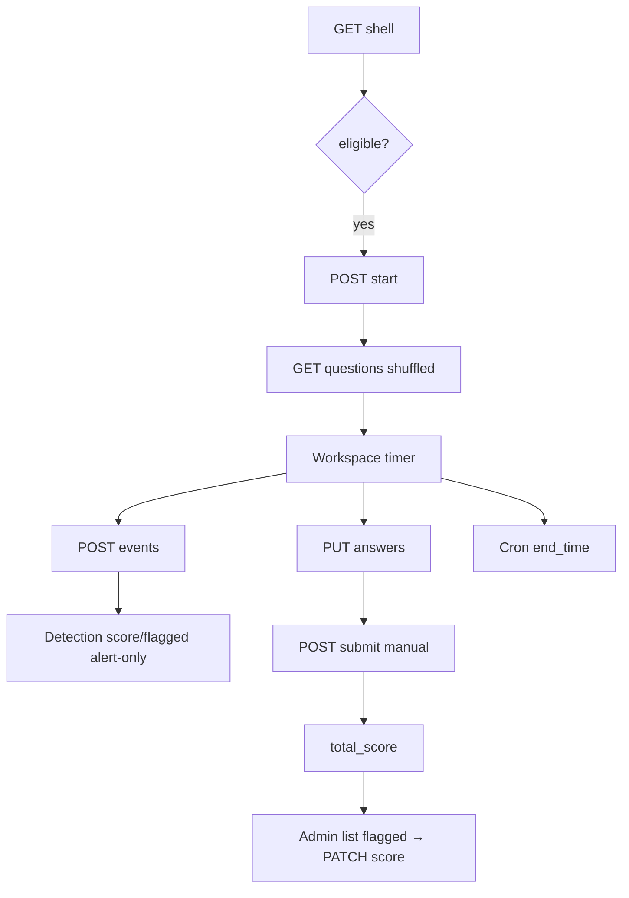

# Spec: Pengerjaan Olimpiade — Timed Exam + Cheat Detection Alert-Only + Admin Mutable Score

**Date:** 2026-08-29
**Status:** Approved (C1)
**Plan:** `docs/superpowers/plans/2026-08-29-olympiad-execution-cheat-detection.md`
**Related Code:** `Exam, ExamQuestion, ExamAttempt, ExamAnswer, ExamEventLog, Stage`

---

## 1. Overview

Team OLIMPIADE mengerjakan ujian timed per-stage. Window `Exam.start_date → end_date`, `duration` menit, `max_attempts`, `shuffle_questions/options`, `show_result_immediately`. Cheat detection **alert-only** (flagged hanya badge, tidak auto-diskualifikasi), juri putuskan. Admin dapat update manual `total_score` (re-grade). Semua UPFRONT, jadi exam tidak ada payment gate.

## 2. Goals

- G1: Team dapat `start` attempt jika `current_stage_id==exam.stage_id` dan window open dan `attempts < max_attempts`.
- G2: Soal dikirim tanpa `correct_answer/explanation`, shuffle sekali simpan `metadata.questionOrder`.
- G3: Team dapat `save answers` batch dengan `is_correct/score_obtained` (server hitung, hide jika `show_result_immediately=false`).
- G4: Cheat events `tab_switched, window_blurred, copy, paste, devtools, fullscreen_exited, disconnected` → `POST /events` batch → `suspicious_score` + `flagged` alert-only.
- G5: `submit` manual + `auto-submit` cron jika `end_time < now`, hitung `total_score`.
- G6: Admin dapat `list flagged`, `detail timeline`, `PATCH score` mutable dengan audit.

## 3. Non-Goals

- Tidak auto-diskualifikasi, tidak auto-penalti, tidak hard block devtools.
- Tidak ada plagiarism text similarity (di luar scope).
- Tidak ada proctor video.
- Tidak ubah `payment_for_stage_id`.

## 4. Architecture

```
Dashboard/Olympiad/Show.tsx CTA → POST /dashboard/exams/{exam}/attempts (ExamAttemptService.start)
  → ExamWorkspace.tsx (features/exam)
    → TimerBadge (remainingMs = end_time - serverTime, isolated setInterval)
    → QuestionCard (RichText sanitized) + QuestionNav
    → useSaveAnswers debounce 800ms → PUT /attempts/{id}/answers (ExamScoringService)
    → visibility/copy/paste/fullscreen listeners → queue events → POST /attempts/{id}/events batch via sendBeacon (ExamDetectionService)
    → POST /attempts/{id}/submit → finished, total_score
  → Cron AutoSubmitExpiredAttempts

Admin: GET /admin/exams/{exam}/attempts?flagged → PATCH /admin/.../score (ExamJudgingService + audit)
```

Server authority `end_time = min(now+duration, exam.end_date)`, `remainingMs` dari server.

## 5. Data Model

**Reuse existing (no migration):**
- `exam_attempts`: `team_id, exam_id, start_time, end_time, finished bool, flagged bool, cheat_count int, suspicious_score int, device_id, ip_address, user_agent, metadata json, total_score, max_possible_score, reviewed_by`
- `exam_event_logs`: `attempt_id FK, type enum 20, metadata json, timestamps, index(attempt_id,created_at)`
- `exam_answers`: `attempt_id, question_id unique, answer text, selected_options json, is_correct bool nullable, score_obtained int, answered_at, time_spent int`
- `exam_questions`: `exam_id, question, explanation, type, options json, correct_answer, order, correct_score/wrong_score/empty_score, difficulty, category, tags, is_active`
- `exams`: `stage_id, title, start_date, end_date, duration, passing_score, type, shuffle_questions/options, show_result_immediately, max_attempts, settings json`

## 6. API Contract

### Team — 7 endpoints under `prefix('dashboard') auth:sanctum+team.verified`

**1) GET /api/dashboard/exams/{exam} — Shell + attempt summary**
- 200: `{exam{id,title,startDate,endDate,duration,maxAttempts}, stage, competition, batch, attempt:{id,startTime,endTime,remainingMs,finished,flagged,attemptCount}|null, serverTime}`

**2) POST /api/dashboard/exams/{exam}/attempts — Start**
- Checks: `team.current_stage_id==exam.stage_id`, `now∈[start,end]`, `count<max_attempts`, `no unfinished` else 409
- Effect: `create attempt max_possible_score=sum correct_score`, `event started`, `metadata.questionOrder=shuffle if needed`
- 201: `{attempt, questions:[{id,question,type,options,order}|without correct_answer], serverTime}`
- 403/422/409

**3) GET /api/dashboard/exams/{exam}/attempts/{attempt} — Resume**
- Checks: `attempt.team_id==team.id`
- 200: same as start + `savedAnswers`

**4) PUT /api/dashboard/exams/{exam}/attempts/{attempt}/answers — Batch Save**
- Request: `answers: [{question_id uuid, selected_options array, answer string max5000, time_spent 0-3600}] max50`
- Logic: `is_correct` via `ExamScoringService`, `score_obtained` via `correct/wrong/empty_score`, `upsert ExamAnswer`, `event question_answered`
- 200: `{saved: n, total_score_preview: n|hidden}`

**5) POST /api/dashboard/exams/{exam}/attempts/{attempt}/events — Cheat Batch**
- Request: `events: [{type in enum, metadata json, clientAt iso}] max50`
- Weights: `tab_switched 5, window_blurred 5, fullscreen_exited 8, copy 10, paste 15, right_click 3, devtools 25, screenshot 12, suspicious 20, device drift 20`, `flagged = score>=50 OR cheat_count>=5`
- 200: `{ingested, suspiciousScore, flagged}`, 422

**6) POST /api/dashboard/exams/{exam}/attempts/{attempt}/submit — Manual**
- Checks: `!finished`, `now <= end_time+grace 60s`
- Effect: `finished=true, end_time=now, total_score=sum score_obtained, event submitted`
- 200: `{attempt, showResult}`

**7) POST /api/dashboard/exams/{exam}/attempts/{attempt}/heartbeat**
- Body: `clientTime`
- Effect: `metadata.heartbeatAt=now`

**Admin — 3 endpoints `auth:admins`**

**8) GET /api/admin/exams/{exam}/attempts?flagged&finished&search&page**
- 200 paginated `ExamAttemptResource` with `team, flagged, suspiciousScore`

**9) GET /api/admin/exams/{exam}/attempts/{attempt}** — detail + `answers + event timeline + correct_answer` (admin only)

**10) PATCH /api/admin/exams/{exam}/attempts/{attempt}/score — Mutable**
- Request: `total_score required integer 0-max_possible_score, reason required 1-2000`
- Effect: `update total_score, reviewed_by=admin.id, audit exam.score_updated`
- 200: `ExamAttemptResource`

## 7. UI/UX

**Show.tsx:** CTA `Mulai Ujian` if `attemptCount < max && window open`, else `Lanjutkan` if unfinished, else `Lihat Hasil`.
**ExamWorkspace.tsx:** Layout `Nav (1/4) + Card (2/4) + Timer (1/4)`, `TimerBadge` isolated (no global re-render), `QuestionCard` with `RichText` (sanitized ImageKit), `Save` debounce, `Submit` + `AlertDialog`, listeners `visibilitychange→tab_switched, blur→window_blurred, copy/paste/contextmenu, fullscreenchange, key F12`, queue batch `POST /events` via `fetch` + `sendBeacon` fallback, offline `localStorage` sync.
**Admin:** `Exams/Attempts/Index.tsx` table `Team | Score | Flagged badge red | Time | Aksi`, `Detail` timeline `ExamEventLog`, `PATCH score` dialog.

## 8. Flow



## 9. Error Handling

- 403 not eligible, 422 window/max_attempts, 409 unfinished exists, 422 validation per field, 429 throttle `exam.events 60/min, exam.submit 10/min`.

## 10. Security

- `Team.current_stage_id` check, `exam.stage.competition.type==OLIMPIADE`, `attempt.team_id` ownership, `lockForUpdate` for `max_attempts` race, `serverTime` authority, `shuffle` hide `correct_answer`, `Gate judge` for admin mutable.

## 11. Testing

- `ExamAttemptTest` 8: start window, max_attempts, resume saved, save correct/incorrect, essay null, submit total, auto cron
- `ExamDetectionTest` 4: tab score, devtools flagged, device drift, paste
- `ExamScoreUpdateTest` 3: admin update, beyond max fails, list flagged
- `tsc --noEmit`, `pint`, `schedule:run --dry-run`

## 12. Rollout

- No migration, cron `schedule:weekly`? actually `everyMinute` for auto-submit, deploy BE then FE workspace lazy loaded, feature flag not needed.
