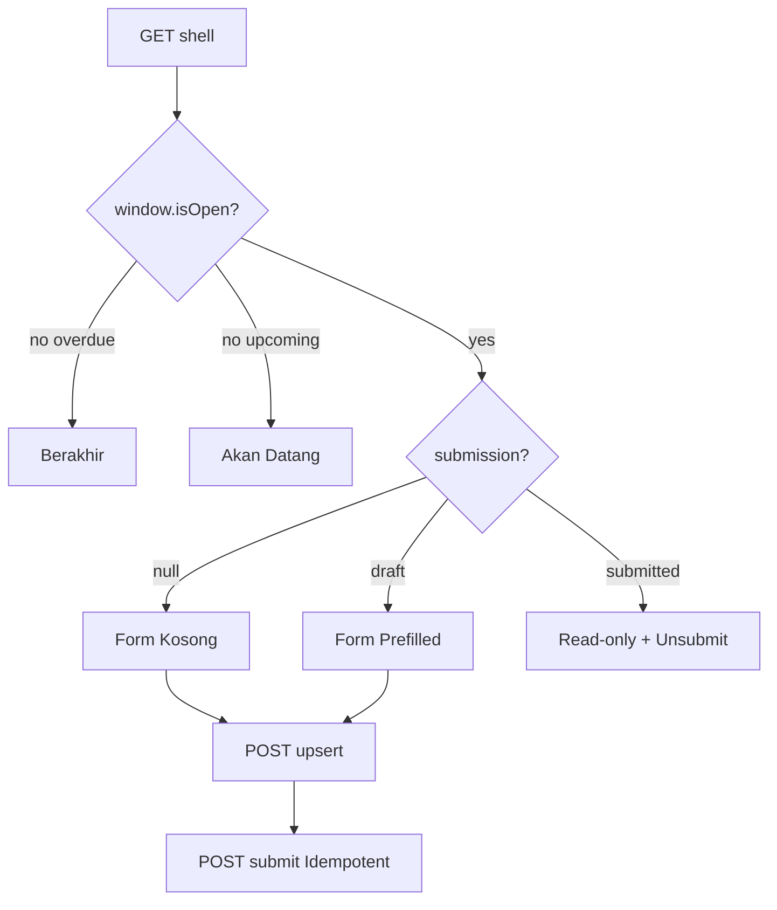

# Spec: Submission Direct Collection — All UPFRONT, No Payment Gate

**Date:** 2026-08-29
**Status:** Approved (AA1)
**Plans:** `docs/superpowers/plans/2026-08-29-submission-direct-collection.md`
**Author:** brainstorming + writing-plans skill
**Related Code:** `Submission`, `Stage`, `File (SUBMISSION)`, `DashboardService.getSubmissionShell`, `FileUpload`

---

## 1. Overview

Submission adalah pengumpulan karya per-stage untuk `BUSINESS_PLAN` dan `BUSINESS_IT_CASE`. Setelah unify `2026-08-28-unified-upfront-payment-flow-v2`, semua lomba bayar **UPFRONT di registrasi awal**, jadi dashboard submission **tidak ada payment gate**. Participant cukup kumpul langsung selama `Stage.start_date → end_date` terbuka.

Spec ini mendefinisikan **read + write** submission yang sebelumnya hanya `GET shell` tanpa `POST`. DB sudah siap (`submissions` unique team+stage, `file_id FK`), tinggal API + UI.

## 2. Goals

- G1: Team `VERIFIED` dengan `current_stage_id == stage.id` dapat lihat `window{isOpen,remainingMs}` + `submission|null` + `canSubmit`.
- G2: Team dapat `upsert draft` (`title, description, file_id`) selama window open, via ImageKit `purpose=SUBMISSION`.
- G3: Team dapat `submit` → `status=submitted, submitted_at=now`, idempotent via `Idempotency-Key`.
- G4: Team dapat `unsubmit` (tarik) selama belum `reviewed` dan window open.
- G5: UI `Dashboard/Submission/Show.tsx` tanpa payment, dengan `FileUpload`, countdown, dan status card.

## 3. Non-Goals

- Tidak ada payment di submission (ignore `payment_for_stage_id`).
- Tidak ada versioning table (cukup `metadata.version`).
- Tidak ada rubric (itu Plan B).
- Tidak ada auto-advance stage (manual admin, existing).

## 4. Architecture

```
Inertia Page Show.tsx
  → useSubmissionShell (GET shell) → DashboardService.getSubmissionShell (window/canSubmit/submission)
  → SubmissionForm (FileUpload SUBMISSION → POST /files → file_id)
    → POST /dashboard/stages/{stage}/submission (upsertDraft)
    → POST /dashboard/stages/{stage}/submission/submit (finalize)
  → SubmissionService (DB::transaction + lockForUpdate + assertWindowOpen + assertOwnedFile)
    → Submission (HasUuids, SoftDeletes, unique team+stage) + File
    → SubmissionResource (camelCase)
```

Follow existing `RegistrationService` pattern: transaction, row lock, `ValidationException`, `SecurityAuditService` tidak perlu untuk Team (hanya Admin).

## 5. Data Model

**Existing `submissions` (no migration):**
```sql
id uuid PK, team_id FK teams, stage_id FK stages, title varchar, description text, file_id FK files nullable,
status enum[draft,submitted,under_review,approved,rejected,revision_requested] default draft,
reviewed_by FK admins, reviewed_at, feedback text, score int, metadata json, submitted_at, timestamps, softDeletes,
unique(team_id,stage_id), index(stage_id,status)
```

`Submission.php` fix `HasUuids` sudah. `metadata` untuk `{version, submittedCount}`.

**Stage window:** `stages.start_date, end_date datetime nullable` → `isOpen = start<=now<=end`, `isOverdue = now>end`, `remainingMs = end-now` if isOpen.

## 6. API Contract

### GET /api/dashboard/stages/{stage}/submission — Shell
- Auth: `auth:sanctum + principal.team + team.verified`
- Authorize: `isBusinessCompetition && stage.competition_id==registration.competition_id && team.current_stage_id==stage.id` else 403
- 200: `{stage, competition, batch, window{isOpen,isOverdue,remainingMs,startDate,endDate}, submission{...file}|null, canSubmit}`
- 403/401/404

### POST /api/dashboard/stages/{stage}/submission — Upsert Draft
- Request `snake`: `title required 3-180, description nullable max5000, file_id nullable uuid exists:files,id` + owned check `File.uploaded_by==team.id && purpose==SUBMISSION`
- Checks: `window.isOpen` else 422 `Periode pengumpulan tidak dibuka`
- Logic: `firstOrCreate` + `lockForUpdate`, allow if `status in [draft,revision_requested,rejected]` else 422 `Sudah terkumpul`
- 200/201: `SubmissionResource`

### POST /api/dashboard/stages/{stage}/submission/submit — Finalize
- Header `Idempotency-Key: uuid` optional (cache 5m)
- Checks: `window.isOpen`, `file_id != null` else 422 `File wajib`, `status in [draft,revision_requested,rejected]`
- Effect: `status=submitted, submitted_at=now(), metadata.submittedCount++`
- 200: `SubmissionResource`, idempotent same key → same id

### POST /api/dashboard/stages/{stage}/submission/unsubmit
- Checks: `status==submitted && window.isOpen && reviewed_at==null`
- Effect: `status=draft`
- 200

Envelope sukses `{status:success, message, data, metadata:{}, error:null}`, gagal `{status:error, error:{code,details}}`, 422 details per field, 429 throttle.

## 7. UI/UX

**Show.tsx states:**
- `Upcoming`: `window.isOpen==false && now<start` → `Hourglass` + `Akan Datang 12 Sep`
- `Open`: `isOpen==true` → `UploadCloud` + `Sisa 6 hari 2 jam` (live tick `setInterval 60s` isolated), `CheckCircle` banner `Tidak ada pembayaran`
- `Overdue`: `isOverdue==true` → `CircleAlert` + `Berakhir`
- Submission card jika exists: `title, score, feedback, file link`, badge `draft/submitted/approved` variant
- Form jika `canSubmit`: `Input title, Textarea description, FileUpload purpose=SUBMISSION folder=/submissions/{stageId} max20mb`, `Simpan Draft` (POST upsert), `Kumpulkan` (POST submit + AlertDialog), `Unsubmit` if submitted. Disabled if `!canSubmit`.

Reuse `DashboardBackdrop, error-portal-card, Card, Badge, Button, FileUpload`, Tailwind glassmorphism.

## 8. Flow



## 9. Error Handling

- 403 tahap tidak tersedia (competition mismatch atau bukan current_stage)
- 422 window closed, title/file validation, foreign file, status not draft
- 409 unique violation handled via upsert
- 401 unauthenticated

## 10. Security

- `Team.verified` middleware, `stage.competition_id` check, `file.uploaded_by` check, `window` server time, `lockForUpdate` prevent race, `Idempotency-Key` prevent double submit.

## 11. Testing

- `SubmissionShellDirectCollectionTest` (3 passed) + `SubmissionTest` (6: upsert, window closed, foreign file, submit requires file, idempotent, unsubmit) + `TeamActivityDashboardTest` updated.
- `tsc --noEmit`, `php artisan test`, `pint --test`.

## 12. Rollout

- No migration, backward compat (old `payment_for_stage_id` ignored).
- Deploy BE first, then FE `Show.tsx` (feature flag not needed, shell baru backward compat karena tambah field, tidak hapus lama secara breaking jika FE lama masih baca `window` optional — tapi FE lama sudah diupdate, jadi deploy atomik).
