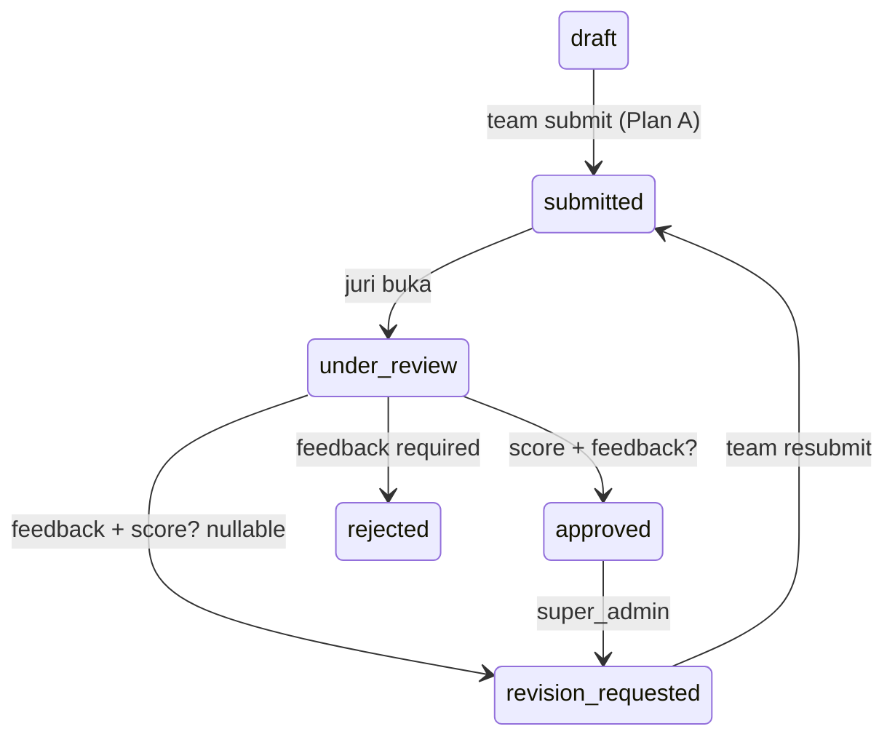

# Spec: Penilaian Submission — Simple Score 0-100 + Feedback

**Date:** 2026-08-29
**Status:** Approved (B1)
**Plan:** `docs/superpowers/plans/2026-08-29-submission-judging-simple.md`
**Related Code:** `Submission.score/feedback/reviewed_by/at, Stage, AdminStageService.scores()`

---

## 1. Overview

Juri menilai submission per-team per-stage dengan **1 skor + 1 feedback + 1 status putusan**. Tidak ada rubric per kriteria (Simple). Nilai langsung jadi final, tidak ada multi-juri agregasi. Alert `flagged` dari detection hanya info, tidak block.

## 2. Goals

- G1: Admin `judge/super_admin` dapat list `submissions` per `stage` terfilter `status/search`, paginated.
- G2: Admin dapat detail `submission` + `team + file + stage`.
- G3: Admin dapat `review` → `status in [approved,rejected,revision_requested,under_review]`, `score 0-100`, `feedback 1-2000` (required untuk rejected/revision_requested), `reviewed_by/at`.
- G4: Audit `admin_audit_logs` dengan `X-Request-ID`.
- G5: UI `Admin/Judging.tsx` table + `JudgingDialog` form.

## 3. Non-Goals

- Tidak ada rubric per kriteria (ditolak, Simple enough).
- Tidak ada multi-juri voting atau average.
- Tidak ada plagiarism check (cukup manual).
- Tidak ubah `Stage.criteria`.

## 4. Architecture

```
Admin/Judging.tsx (table filters)
  → useJudgingList (GET /admin/stages/{stage}/submissions)
  → JudgingDialog (POST /admin/submissions/{id}/review {action,score,feedback})
    → JudgingController → JudgingService (lockForUpdate, transition check)
      → Submission + AdminAuditLog
      → JudgingSubmissionResource
```

Reuse `SecurityAuditService` seperti `AdminRegistrationService`.

## 5. Data Model

Reuse `submissions` columns existing: `score, feedback, reviewed_by, reviewed_at, status`. No migration. `status` transition via service, `metadata` not used.

## 6. API Contract

### GET /api/admin/stages/{stage}/submissions
- Auth: `auth:admins` + `judge|super_admin|admin_registration`
- Query: `status, search (team code/name), page, per_page max100`
- Order: `submitted:0, under_review:1, revision_requested:2, others 3`, then `submitted_at asc`
- 200: `{data:[{id,team:{code,name},title,status,score,submittedAt,file:{url}}], meta:{total}}`
- 403/401

### GET /api/admin/submissions/{submission}
- 200: `JudgingSubmissionResource` `{id,title,description,status,score,feedback,submittedAt,reviewedAt,reviewedBy, team:{...}, stage:{...}, file:{...}}`

### POST /api/admin/submissions/{submission}/review
- Request: `action required in [approved,rejected,revision_requested,under_review], score nullable integer 0-100 (required_if action==approved), feedback nullable string max2000 (required_if action in [rejected,revision_requested])`
- Transitions:
```
draft/submitted/revision_requested/rejected/under_review -> under_review
submitted/under_review -> approved (score required) / rejected / revision_requested
approved -> revision_requested (super_admin re-open)
```
- Effect: `update status,score,feedback,reviewed_by=admin.id,reviewed_at=now()`, audit `judging.review`
- 200: `JudgingSubmissionResource`
- 403/422/409

## 7. UI/UX

**Judging.tsx:**
- Filters: `Select status`, `Input search`, `per_page`
- Table: `Team | Judul | Status badge | Score | SubmittedAt | Aksi (Nilai)`
- Badge: `approved green, rejected red, revision_requested amber, submitted/under_review blue`
- `JudgingDialog`: `Select action, Input number score 0-100, Textarea feedback`, `File preview link`, `X-Request-ID` auto via `adminApi.requestHeaders()`
- List invalidation on success via TanStack `invalidateQueries(adminKeys)`.

## 8. Flow



## 9. Error Handling

- 403 if not judge, 422 score/feedback validation, 409 invalid transition (e.g., draft -> approved directly without under_review? allow but warn — service allows submitted/under_review → approved, but draft → approved blocked).

## 10. Security

- Gate `judge` role, `lockForUpdate` prevent double review, audit, `X-Request-ID`.

## 11. Testing

- `tests/Feature/Judging/JudgingTest.php` 6 tests: approve with score, revision without feedback fails, score out of range, list filter, detail, 403 team token.
- `AdminStageScoresTest` keep.

## 12. Rollout

- No migration, deploy BE + FE atomik, admin role `judge` already exists.
